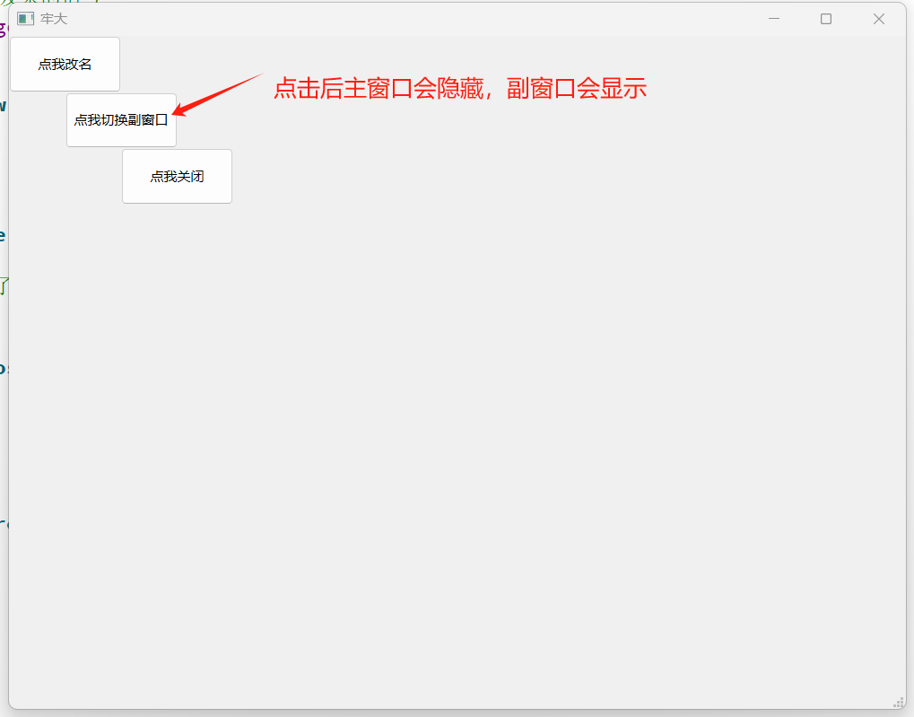
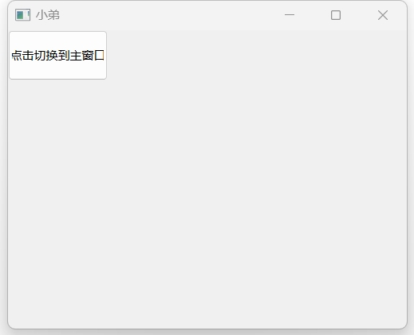

# 第一天

### 关于a.exec()

##### 在main.cpp文件中最后返回的是“a.exec()”

##### exec()的作用是利用while让程序一直执行，直到用户操作中断这个循环

##### 如果改为return 0;就会出现窗口一闪而过；总之非常重要，务必要写

```c++	
return app.exec();
```

### 指定父对象

##### 在没有给控件对象指定父对象的情况下，窗口之间是独立的，互不相关。为了实现在窗口中包含按钮的效果，需要给按钮控件指定其父对象

```c++
int main(int argc, char *argv[])
{
    //只有一个
    QApplication app(argc, argv);
    //w是一个窗口对象
    Widget w;

    //设置窗口标题
    w.setWindowTitle("Hello World");
    //窗口默认隐藏，需要通过show方法让他显示
    w.show();

     //数据类型：QPushButton
     //名称：b
     //按钮设置名称：我是按钮
    QPushButton b;
    b.setText("我是按钮");

    //给b设置父控件
    //因为如果不设置，按钮和窗口是单独分开的，我们希望窗口中包含按钮
    //setParent传入指针
    b.setParent(&w);
    
    //坐标原点在窗口左上角，单位像素
    b.move(100,100);
    
    //让按钮显示出来
    b.show();

    //等同于return 0;
    //exec()的作用是利用while让程序一直执行，直到用户操作中断这个循环
    //总之这个步骤十分重要，千万不能忘记
    return app.exec();
}
```

##### 我们也有简化写法

```c++
int main(int argc, char *argv[])
{
    //只有一个
    QApplication app(argc, argv);
    //w是一个窗口对象
    Widget w;

    //设置窗口标题
    w.setWindowTitle("Hello World");

    QPushButton b(&w);
    b.setText("我是按钮");
    b.move(100,100);
    w.show();

    return app.exec();
}

```

### 标准信号和槽

##### 为了不使main.cpp中的代码过于冗长，也为了更好地设计符合我们需要的自定义控件，对于父控件中的**子控件的** **定义**可以写在父控件对应的头文件中，在main.cpp引入头文件即可

##### 如果我们强行把子控件（QPushButton）写在父控件（QWidget）的函数里

```c++
Widget::Widget(QWidget *parent)
    : QWidget(parent)
    , ui(new Ui::Widget)
{
    ui->setupUi(this);
    //button写在widget的函数里
    QPushButton b;
    b.setParent(this);
    b.setText("构造函数中定义子控件");
}
```

##### 实际运行是看不见子控件（QPushButton）的

##### **注意：执行完父控件的构造函数后，定义在父控件构造函数中的子控件就不复存在了，因此父控件中不会显示子控件。**

##### 所以，我们需要在父控件的class类里声明子控件

```c++	
//widget.h文件，别忘了加QPushButton的头文件
class Widget : public QWidget
{
    Q_OBJECT

public:
    Widget(QWidget *parent = nullptr);
    ~Widget();

private:
    Ui::Widget *ui;
    QPushButton b1;
    QPushButton *b2;
};
--------------------------------------------------------------------------
//widget.cpp文件
Widget::Widget(QWidget *parent)
    : QWidget(parent)
    , ui(new Ui::Widget)
{
    ui->setupUi(this);
    //这里的this指向QWidget
    b1.setParent(this);
    b1.setText("构造函数中定义子控件");
    
    //b2按钮我们是通过new方法创建出来的，他是指针
    b2=new QPushButton(this);
    b2->move(500,100);
    b2->setText("这是另一个按钮");
}
```

### connect信号

##### Qt中用一个connect()方法来建立父控件与子控件之间的联系。用法是：

```c++
connect(sender, SIGNAL(signal), receiver, SLOT(slot));
```

##### 其中，sender是信号发送者，SIGNAL(signal)是处理的信号，receiver是信号接收者，SLOT(slot)是信号处理函数

```c++
Widget::Widget(QWidget *parent)
    : QWidget(parent)
    , ui(new Ui::Widget)
{
    ui->setupUi(this);
    //这里的this指向QWidget
    b1.setParent(this);
    //我把b1改名了
    b1.setText("点我关闭");

    //b2按钮我们是通过new方法创建出来的，他是指针
    b2=new QPushButton(this);
    b2->move(500,100);
    b2->setText("这是另一个按钮");

    connect(&b1,&QPushButton::pressed,this,&Widget::close);
}
```

##### 在connect函数中 &b1（指针）：b1是信号的发出者

##### &QPushButton::pressed ：什么操作发出了信号，&发出信号者的类名::信号名字（QT内置函数或者自定义函数）

##### this:信号接收者，这里this指Widget

##### &widget::close ：槽函数，信号处理函数；&接受者的类名:槽函数名称（QT内置函数或者自定义函数）

##### 如果要寻找信号名称或槽函数名称，按下F1，打开文档，搜索类名，右边导航找signal；如果没有这个选项，那可能是在当前类所继承的基类中，在首页找到 Inherits，去他的基类找

### 自定义槽函数

##### 如果QT内置的函数无法满足我们的要求，我们可以自定义槽函数

##### 先在widget.h，父类中声明

```c++
class Widget : public QWidget
{
    Q_OBJECT

public:
    Widget(QWidget *parent = nullptr);
    ~Widget();
    //声明槽函数
    void reName();

private:
    Ui::Widget *ui;
    QPushButton b1;
    QPushButton *b2;
};
```

##### 自定义槽函数

```c++
//点击按钮，按钮改名
void Widget::reName()
{
    b2->setText("我改名了");
}
```

##### 信号和槽

```c++
//这里b2本来就是指针，所以不需要加&
connect(b2,&QPushButton::pressed,this,&Widget::reName);
```

### **实验：实现两个独立窗口**

##### 除了普通的main文件，我们再新建subwidget.h和subwidget.cpp文件，用于表示第二个子窗口

```c++
//subwidget.h 副窗口头文件
#ifndef SUBWIDGET_H
#define SUBWIDGET_H

#include <QWidget>
#include <QPushButton>
//这个地方subwidget类继承QWidget类
class SubWidget : public QWidget
{
    Q_OBJECT
public:
    explicit SubWidget(QWidget *parent = 0);

signals:

public slots:

private:
    QPushButton b;

};

#endif // SUBWIDGET_H

```

```c++
//subwidget.cpp 副窗口构造函数
#include "subwidget.h"

//Subwidget构造函数继承QWidget
SubWidget::SubWidget(QWidget *parent) : QWidget(parent)
{
    this->setWindowTitle("小弟");
    b.setText("点击切换到主窗口");
    b.setParent(this);
}

```

##### 在这里subwidget属于子类，继承父类

##### 因为在main.cpp中，只对widget进行显示，subwidget是独立于widget的，它就不会显示。

##### 因此在副窗口中我们需要给主窗口发送信号，告诉副窗口要进行的操作这里我们定义signal为mySignal

```c++
//subwidget.h 副窗口头文件
#ifndef SUBWIDGET_H
#define SUBWIDGET_H

#include <QWidget>
#include <QPushButton>
class SubWidget : public QWidget
{
    Q_OBJECT
public:
    explicit SubWidget(QWidget *parent = 0);
    void sendSlot(); //这是常函数

signals:
    /*
        信号必须有signals关键字来声明
        信号没有返回值，但可以有参数
        信号就是函数的声明，只需声明，无需定义
        使用：emit mySignal();
    */
    void mySignal();    //这是信号

public slots:


private:
    QPushButton b;

};

#endif // SUBWIDGET_H

```

```c++
//subwidget.cpp 副窗口构造函数
#include "subwidget.h"

SubWidget::SubWidget(QWidget *parent) : QWidget(parent)
{
    this->resize(400,300);
    this->setWindowTitle("小弟");
    b.setText("点击切换到主窗口");
    b.setParent(this);
    b.resize(100,50);
    connect(&b,&QPushButton::released,this,&SubWidget::sendSlot);
}

void SubWidget::sendSlot()
{
    emit mySignal();
}
```

```c++
//MainWidget.h
#ifndef MAINWINDOW_H
#define MAINWINDOW_H
#include<QPushButton>
#include"subwidget.h" //引入副窗口的头文件

#include <QMainWindow>

QT_BEGIN_NAMESPACE
namespace Ui { class MainWindow; }
QT_END_NAMESPACE

class MainWindow : public QMainWindow
{
    Q_OBJECT

public:
    MainWindow(QWidget *parent = nullptr);
    ~MainWindow();
    void reName();
    void hideBoss();
    void hideBro();

private:
    Ui::MainWindow *ui;
    QPushButton b1;
    QPushButton* b2;
    QPushButton b3;
    SubWidget w; //在主窗口的类中引入副窗口
};
#endif // MAINWINDOW_H

```

```c++
#include "mainwindow.h"
#include "ui_mainwindow.h"
#include<QPushButton>

MainWindow::MainWindow(QWidget *parent)
    : QMainWindow(parent)
    , ui(new Ui::MainWindow)
{
    ui->setupUi(this);
    b1.setParent(this);
    b1.setText("点我关闭");
    b1.move(100,100);
    b1.resize(100,50);


    b2=new QPushButton(this);
    b2->setText("点我改名");
    b2->resize(100,50);

    connect(&b1,&QPushButton::pressed,this,&QWidget::close);
    //让b2改名
    connect(b2,&QPushButton::released,this,&MainWindow::reName);
    //改名后让b1按钮消失
    connect(b2,&QPushButton::released,&b1,&QPushButton::hide);

    this->setWindowTitle("牢大");
    b3.setText("点我切换副窗口");
    b3.setParent(this);
    b3.move(50,50);
    b3.resize(100,50);

    //点击b3按钮隐藏主窗口
    connect(&b3,&QPushButton::released,this,&MainWindow::hideBoss);
    //主窗口接收到了副窗口发来的信号
    connect(&w,&SubWidget::mySignal,this,&MainWindow::hideBro);
}

MainWindow::~MainWindow()
{
    delete ui;
}

void MainWindow::reName()
{
    b2->setText("我改名了");
}

void MainWindow::hideBoss()
{
    this->hide();
    w.show();
}

void MainWindow::hideBro()
{
    this->show();
    w.hide();
}


```





##### 这个程序第一次看其实没太看懂，后面就理解了，简单来说，副窗口和主窗口不能形成父子关系，因为这样副窗口就只会包含在主窗口中，这不是我们想要的效果；于是我们在subWidget.h中定义了mySignal()这个信号函数，然后在MainWindow.cpp中写了一个函数hideBro，当用户在subWidget点击了b按钮，这个按钮就会执行sendSlot()这个函数，把信号通过emit mySignal的方式发送出去，这时MainWindow接收到这个信号，他与hideBro()形成了一种绑定关系，从而控制主窗口的行为。所有的函数操作都是在MainWindow这边定义执行的，发送相应的信号执行对应的函数。
