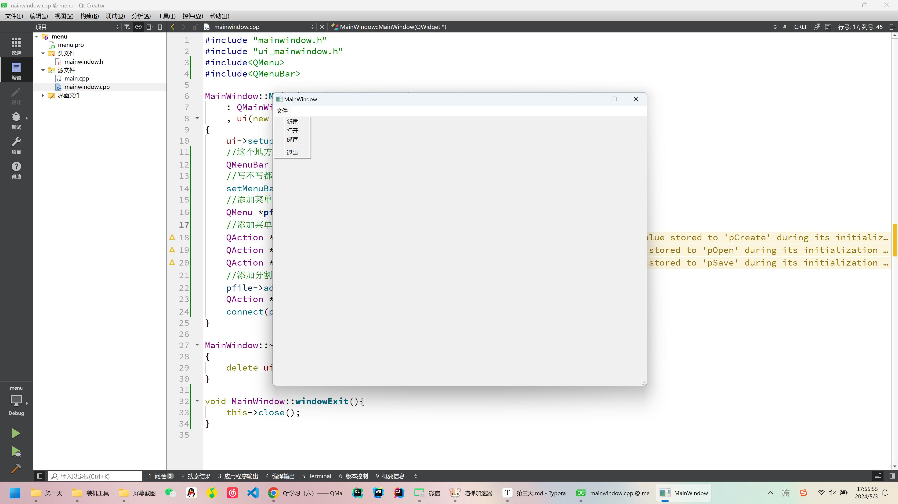
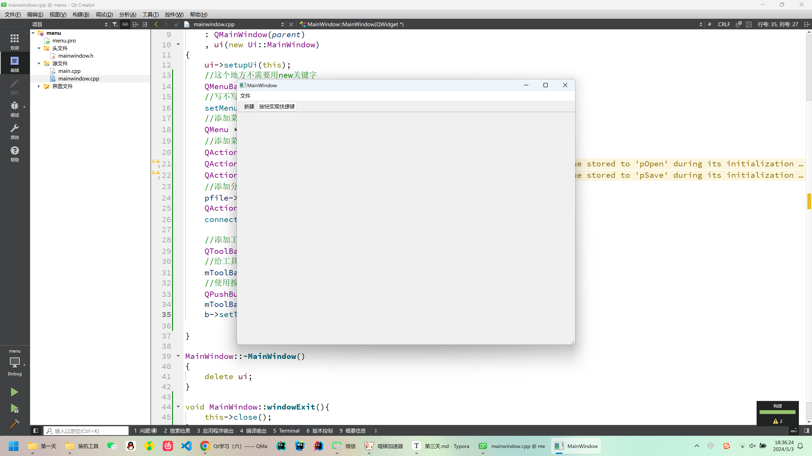
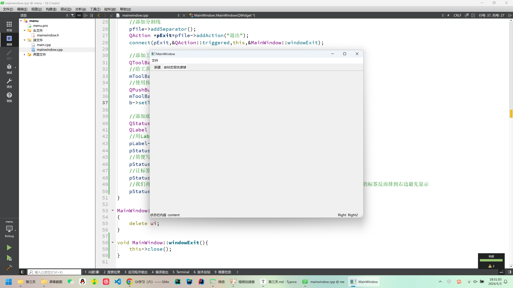
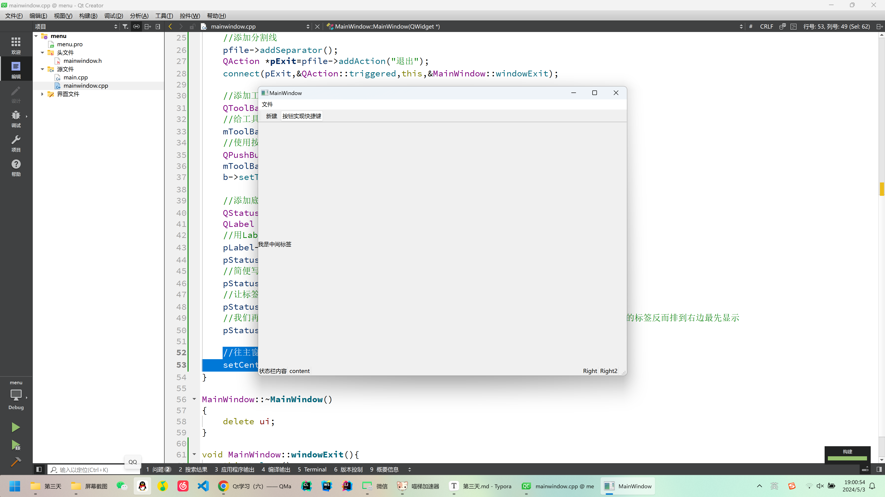
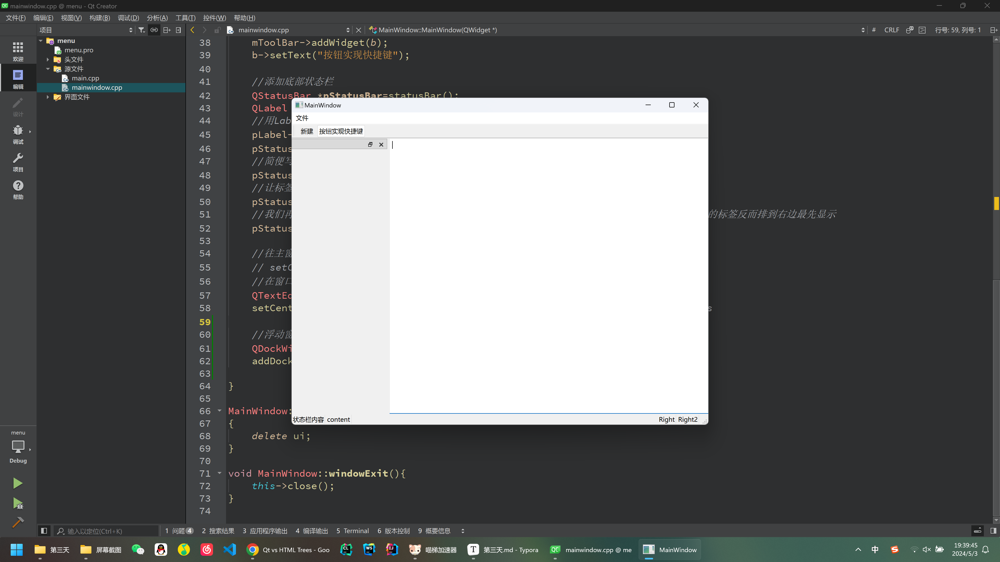
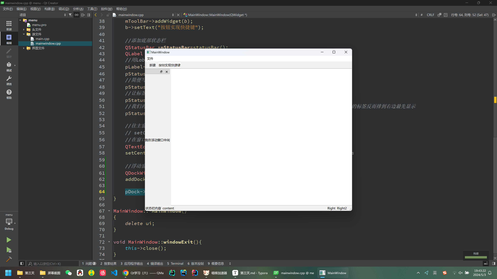

# 第三天

## QWidget对象模型

##### 在Qt中，所有窗口及窗口控件都是从QWidget直接或间接派生出来的。

### 对象模型

##### 在QT中，对象树是指QT框架中管理对象关系的一种结构，它是由`QObject`派生类组成的树形结构，每个`QObject`派生类都可以有零个或多个子对象。这种对象树结构用于管理对象的生命周期和父子关系。

##### 当你创建一个`QObject`对象时，会看到`QObject`的构造函数接收一个`QObject`指针作为参数，这个参数就是` parent`，也就是父对象指针。这相当于，**在创建`QObject`对象时，可以提供一个其父对象，我们创建的这个`QObject`对象会自动添加到其父对象的`children()`列表。**

##### 当父对象析构的时候，这个列表中的所有对象也会被析构。（注意，这里的父对象并不是继承意义上的父类！）

***

### 与GPT的问答

#### **在QT的对象树中，父对象被销毁，它的子对象也会被一并销毁是吗？**

##### 是的，在QT的对象树中，当父对象被销毁时，它的所有子对象也会被一并销毁。这是因为QT采用了基于父子关系的内存管理机制。当一个QObject派生类对象被创建时，你可以通过设置它的父对象来建立父子关系。当父对象被销毁时，QT会自动递归地销毁其所有子对象，以确保内存资源得到正确释放，避免内存泄漏。

##### 这种自动销毁的机制使得在QT中管理对象生命周期变得更加方便，不需要手动管理每个对象的释放时机，提高了代码的可维护性和健壮性。

#### QT中最大的父对象是QObject吗？

##### 在Qt中，`QObject` 是一个基类，几乎所有的类都是直接或间接地继承自它。虽然 `QObject` 是 Qt 中许多类的基类，但并不是所有类的基类。不过，绝大多数在 Qt 中创建的类都会继承自 `QObject`，因为 `QObject` 提供了信号和槽机制、对象树的管理以及其他很多便利功能。

##### 虽然 `QObject` 是许多类的基类，但它并不是一个界面类或者控件类，而是提供了对象之间通信和管理的功能。在 GUI 编程中，通常你会创建继承自 `QWidget` 或其子类的对象作为界面上的元素，而这些 `QWidget` 对象都是继承自 `QObject` 的，但 `QWidget` 并不是 `QObject` 的直接子类。

#### 那怎么说，最大的父对象是QWidget吗？

##### 在GUI编程中，`QWidget` 是表示用户界面组件的基类，它提供了窗口或者窗口中的控件的基本功能。`QWidget` 是一个继承自 `QObject` 的类，因此它也具有 `QObject` 的所有功能，包括对象树的管理、信号和槽机制等。

##### 因此，可以说在典型的Qt GUI应用程序中，最顶层的父对象通常是继承自 `QWidget` 的窗口对象（比如 `QMainWindow`、`QDialog` 等），它们扮演着用户界面的容器角色。这些窗口对象可能包含其他的 `QWidget` 子类对象，如按钮、标签、文本框等，形成了一个对象树结构。

#### 继承关系和父子类并没有直接的联系吗

##### 你说得对，我可能有点混淆了。继承关系和父子关系确实是两个不同的概念。

##### 继承关系是指一个类（子类）从另一个类（父类）继承了属性和方法。在Qt中，继承关系用于实现类之间的层次结构和代码复用。

##### 而父子关系是指在Qt对象树中的关系，一个对象可以拥有一个父对象，并且可以有零个或多个子对象。这种关系在Qt中用于管理对象的生命周期和对象之间的通信。

##### 在Qt中，一个类可以继承自QObject或其子类以获取Qt的对象模型和信号槽机制的支持。但是，并不是所有继承自QObject的类都会形成父子关系，只有在对象被设置了父对象后，它们之间才会形成父子关系。

***

## 内存回收机制

##### 当一个`QObject`对象**在堆上创建**（比如用 `new` 创建）的时候，Qt 会同时为其创建一个对象树。不过，对象树中对象的顺序是没有定义的。这意味着，销毁这些对象的顺序也是未定义的。

##### 任何对象树中的 `QObject`对象 `delete` 的时候，如果这个对象有 `parent`，则自动将其从 `parent `的`children()`列表中删除；如果有孩子，则自动 `delete` 每一个孩子。Qt 保证没有`QObject`会被` delete 两次`，这是由析构顺序决定的。这个在上方GPT问答有提及过

##### 在C++的学习中，我们知道，用 `new` 关键字申请的动态内存空间如果不及时用 `delete `关键字进行回收会导致内存泄漏问题。

##### 而通过 new 关键字申请的内存如果不用 `delete `关键字释放，就不会调用析构函数。但如果指定父对象后，且父对象不是用 `new` 关键字申请的动态内存空间的话，在程序结束时就会自动调用析构函数，而析构的顺序又是从对象树的底层开始的，这时候即使子对象是用 `new `关键字动态申请内存的，也不需要手动释放子对象的内存。

##### 当前，这么做的前提是：

-  指定了父对象

-  直接或间接继承`QObejct`

##### 解释一下，如果删除父类，其子类也会一并被删除；另一点基本上大部分的类都继承于`QObject`，所以一般的组件不需要管第二点。一些与算法、数据结构等无关的类可能不需要继承自 `QObject`。另外，在一些特殊情况下，你可能会创建不继承自 `QObject` 的类，比如简单的数据模型类、纯粹的数学计算类等。

***

#### 在栈上创建对象和在堆上创建对象有什么区别？

##### 在栈上创建对象和在堆上创建对象有几个关键区别：

1. **生存期**：
   - 栈上创建的对象的生命周期受限于其所在的作用域。当超出作用域范围时，栈上的对象会被自动销毁。
   - 堆上创建的对象的生命周期可以长于其创建时所在的作用域，它们不会自动销毁，直到显式地释放了它们的内存。
2. **内存管理**：
   - 栈上的对象的内存是由系统自动管理的，无需手动分配或释放内存。对象在进入和离开作用域时，内存分配和释放都会自动发生。
   - 堆上的对象的内存分配和释放需要显式地进行。通常使用 `new` 关键字在堆上分配对象，使用 `delete` 关键字释放对象所占用的内存。如果忘记释放堆上分配的内存，就会导致内存泄漏。
3. **访问权限**：
   - 栈上的对象的访问速度更快，因为它们存储在栈内存中，栈内存的访问速度通常比堆内存更快。
   - 堆上的对象的访问速度较慢，因为它们存储在堆内存中，需要通过指针进行间接访问。
4. **对象大小限制**：
   - 栈上的对象通常受到栈大小的限制，因为栈的大小是有限的，如果分配的对象过大，可能会导致栈溢出。
   - 堆上的对象通常受系统可用内存的限制，因为堆内存可以动态分配和释放，只要系统有足够的内存可用。

***
##### 在这个案例中`window`对象和`quit`都是在栈上面创建的，这并没有什么问题

```c++
{
    QWidget window;
    QPushButton quit("Quit", &window);
}
```
##### 在下面这个案例中，先创建的`quit`对象，再创建的`window`对象，最后让`window`作为`quit`的父对象；由于析构函数的调用顺序，最后创建对象的析构函数会最先被调用，因此`window`对象会先被删除，由于`quit`是`window`的子类，也会一并被删除；此时调用`quit`的析构函数，由于`quit`对象已经被删除，`delete`操作无法执行两次，所以程序崩溃

```c++
{
    QPushButton quit("Quit");
    QWidget window;
    quit.setParent(&window);
}
```

##### 为了防止这种情况，我们要注意对象的创建顺序，父类先于子类；或者干脆直接在堆上创建，手动控制对象的删除

```c++
QWidget window;
quit=new QPushButton(&window);
```

## 菜单栏

##### 使用菜单栏需要引入头文件,注意只有MainWindow才有菜单栏

```c++
#include<QMenu>
#include<QMenuBar>
```

##### 使用`menuBar()`函数创建菜单栏，使用`addMenu`创建一级菜单，使用`addAction`创建二级菜单,使用`addSeparator()`函数添加分割线

```c++
#include "mainwindow.h"
#include "ui_mainwindow.h"
#include<QMenu>
#include<QMenuBar>

MainWindow::MainWindow(QWidget *parent)
    : QMainWindow(parent)
    , ui(new Ui::MainWindow)
{
    ui->setupUi(this);
    //这个地方不需要用new关键字
    QMenuBar *mbar=menuBar();
    //写不写都会出现菜单栏，但最好还是写一下
    setMenuBar(mbar);
    //添加菜单要调用QMenuBar对象的addMenu()方法，并用一个QMenu对象指针来接收。
    QMenu *pfile=mbar->addMenu("文件");
    //添加菜单项需要调用QMenu对象的addAction方法，并用一个QAction对象指针来接收它。
    QAction *pCreate=pfile->addAction("新建");
    QAction *pOpen=pfile->addAction("打开");
    QAction *pSave=pfile->addAction("保存");
    //添加分割线
    pfile->addSeparator();
    QAction *pExit=pfile->addAction("退出");
    connect(pExit,&QAction::triggered,this,&MainWindow::windowExit);
}

MainWindow::~MainWindow()
{
    delete ui;
}

void MainWindow::windowExit(){
    this->close();
}

```



## 工具栏

##### 添加`QToolBar`头文件，工具栏不同于菜单栏，它是将菜单栏里面的一些选项放在工具栏，比如一些常用的操作可以放在工具栏；我们也可以用`QPushButton`当做快捷方式，对于一些组件使用`addWidet`添加

```c++
#include "mainwindow.h"
#include "ui_mainwindow.h"
#include<QMenu>
#include<QMenuBar>
#include<QToolBar>
#include<QPushButton>

MainWindow::MainWindow(QWidget *parent)
    : QMainWindow(parent)
    , ui(new Ui::MainWindow)
{
    ui->setupUi(this);
    //这个地方不需要用new关键字
    QMenuBar *mbar=menuBar();
    //写不写都会出现菜单栏，但最好还是写一下
    setMenuBar(mbar);
    //添加菜单要调用QMenuBar对象的addMenu()方法，并用一个QMenu对象指针来接收。
    QMenu *pfile=mbar->addMenu("文件");
    //添加菜单项需要调用QMenu对象的addAction方法，并用一个QAction对象指针来接收它。
    QAction *pCreate=pfile->addAction("新建");
    QAction *pOpen=pfile->addAction("打开");
    QAction *pSave=pfile->addAction("保存");
    //添加分割线
    pfile->addSeparator();
    QAction *pExit=pfile->addAction("退出");
    connect(pExit,&QAction::triggered,this,&MainWindow::windowExit);

    //添加工具栏：菜单栏的快捷方式
    QToolBar *mToolBar=addToolBar("tool");
    //给工具栏添加快捷键
    mToolBar->addAction(pCreate);
    //使用按钮充当快捷方式
    QPushButton *b=new QPushButton(this);
    mToolBar->addWidget(b);
    b->setText("按钮实现快捷键");

}

MainWindow::~MainWindow()
{
    delete ui;
}

void MainWindow::windowExit(){
    this->close();
}

```



## 底部状态栏

##### 添加头文件`QStatusBar`，状态栏会默认从左边显示，可以使用`addPermanentWidget`关键字让标签从右边显示，但是后添加的标签反而最先显示，这一点需要注意

```c++
#include "mainwindow.h"
#include "ui_mainwindow.h"
#include<QMenu>
#include<QMenuBar>
#include<QToolBar>
#include<QPushButton>
#include<QStatusBar>
#include<QLabel>

MainWindow::MainWindow(QWidget *parent)
    : QMainWindow(parent)
    , ui(new Ui::MainWindow)
{
    ui->setupUi(this);
    //这个地方不需要用new关键字
    QMenuBar *mbar=menuBar();
    //写不写都会出现菜单栏，但最好还是写一下
    setMenuBar(mbar);
    //添加菜单要调用QMenuBar对象的addMenu()方法，并用一个QMenu对象指针来接收。
    QMenu *pfile=mbar->addMenu("文件");
    //添加菜单项需要调用QMenu对象的addAction方法，并用一个QAction对象指针来接收它。
    QAction *pCreate=pfile->addAction("新建");
    QAction *pOpen=pfile->addAction("打开");
    QAction *pSave=pfile->addAction("保存");
    //添加分割线
    pfile->addSeparator();
    QAction *pExit=pfile->addAction("退出");
    connect(pExit,&QAction::triggered,this,&MainWindow::windowExit);

    //添加工具栏：菜单栏的快捷方式
    QToolBar *mToolBar=addToolBar("tool");
    //给工具栏添加快捷键
    mToolBar->addAction(pCreate);
    //使用按钮充当快捷方式
    QPushButton *b=new QPushButton(this);
    mToolBar->addWidget(b);
    b->setText("按钮实现快捷键");

    //添加底部状态栏
    QStatusBar *pStatusBar=statusBar();
    QLabel *pLabel=new QLabel(pStatusBar);
    //用Label显示字体
    pLabel->setText("状态栏内容");
    pStatusBar->addWidget(pLabel);
    //简便写法
    pStatusBar->addWidget(new QLabel("content",this));
    //让标签从右边开始显示
    pStatusBar->addPermanentWidget(new QLabel("Right",this));
    //我们再次添加addPermanentWidget，可以发现后面添加的标签最先显示在最后边，也就是说后添加的标签反而排到右边最先显示
    pStatusBar->addPermanentWidget(new QLabel("Right2",this));
}

MainWindow::~MainWindow()
{
    delete ui;
}

void MainWindow::windowExit(){
    this->close();
}

```



## 中心窗口部件

##### 使用`setCentralWidget`函数,在窗口中间添加一个标签

```c++
//往主窗口中添加一个标签
    setCentralWidget(new QLabel("我是中间标签",this));
```



##### 添加头文件`QTextEdit`，在窗口中间添加一个文字框

```c++
#include "mainwindow.h"
#include "ui_mainwindow.h"
#include<QMenu>
#include<QMenuBar>
#include<QToolBar>
#include<QPushButton>
#include<QStatusBar>
#include<QLabel>
#include<QTextEdit>

MainWindow::MainWindow(QWidget *parent)
    : QMainWindow(parent)
    , ui(new Ui::MainWindow)
{
    ui->setupUi(this);
    //这个地方不需要用new关键字
    QMenuBar *mbar=menuBar();
    //写不写都会出现菜单栏，但最好还是写一下
    setMenuBar(mbar);
    //添加菜单要调用QMenuBar对象的addMenu()方法，并用一个QMenu对象指针来接收。
    QMenu *pfile=mbar->addMenu("文件");
    //添加菜单项需要调用QMenu对象的addAction方法，并用一个QAction对象指针来接收它。
    QAction *pCreate=pfile->addAction("新建");
    QAction *pOpen=pfile->addAction("打开");
    QAction *pSave=pfile->addAction("保存");
    //添加分割线
    pfile->addSeparator();
    QAction *pExit=pfile->addAction("退出");
    connect(pExit,&QAction::triggered,this,&MainWindow::windowExit);

    //添加工具栏：菜单栏的快捷方式
    QToolBar *mToolBar=addToolBar("tool");
    //给工具栏添加快捷键
    mToolBar->addAction(pCreate);
    //使用按钮充当快捷方式
    QPushButton *b=new QPushButton(this);
    mToolBar->addWidget(b);
    b->setText("按钮实现快捷键");

    //添加底部状态栏
    QStatusBar *pStatusBar=statusBar();
    QLabel *pLabel=new QLabel(pStatusBar);
    //用Label显示字体
    pLabel->setText("状态栏内容");
    pStatusBar->addWidget(pLabel);
    //简便写法
    pStatusBar->addWidget(new QLabel("content",this));
    //让标签从右边开始显示
    pStatusBar->addPermanentWidget(new QLabel("Right",this));
    //我们再次添加addPermanentWidget，可以发现后面添加的标签最先显示在最后边，也就是说后添加的标签反而排到右边最先显示
    pStatusBar->addPermanentWidget(new QLabel("Right2",this));

    //往主窗口中添加一个标签
    // setCentralWidget(new QLabel("我是中间标签",this));
    //在窗口中间添加一个文字框
    QTextEdit *pTextEdit=new QTextEdit(this);
    setCentralWidget(pTextEdit); //setCentralWidget是MainWindow的方法，这里省略了this
}

MainWindow::~MainWindow()
{
    delete ui;
}

void MainWindow::windowExit(){
    this->close();
}

```

##### **P.S：通过`setCentralWidget`方法被添加到主窗口的中心窗口控部件默认填满整个主窗口，因此如果有多个被添加到主窗口的中心窗口控件，先添加的会被后添加的覆盖，最终只显示最后添加的中心窗口部件。**

## 浮动窗口

##### 添加头文件 `QDockWidget`,使用addDockWidget添加

##### 使用规则

```c++
void QMainWindow::addDockWidget(Qt::DockWidgetArea area, QDockWidget *dockwidget, Qt::Orientation orientation)
```

##### orientation可省略，其中`Qt::DockWidgetArea area`包括

| Constant                 | Value               |
| ------------------------ | ------------------- |
| Qt::LeftDockWidgetArea   | 0x1                 |
| Qt::RightDockWidgetArea  | 0x2                 |
| Qt::TopDockWidgetArea    | 0x4                 |
| Qt::BottomDockWidgetArea | 0x8                 |
| Qt::AllDockWidgetAreas   | DockWidgetArea_Mask |
| Qt::NoDockWidgetArea     | 0                   |

```c++
#include "mainwindow.h"
#include "ui_mainwindow.h"
#include<QMenu>
#include<QMenuBar>
#include<QToolBar>
#include<QPushButton>
#include<QStatusBar>
#include<QLabel>
#include<QTextEdit>
#include<QDockWidget>

MainWindow::MainWindow(QWidget *parent)
    : QMainWindow(parent)
    , ui(new Ui::MainWindow)
{
    ui->setupUi(this);
    //这个地方不需要用new关键字
    QMenuBar *mbar=menuBar();
    //写不写都会出现菜单栏，但最好还是写一下
    setMenuBar(mbar);
    //添加菜单要调用QMenuBar对象的addMenu()方法，并用一个QMenu对象指针来接收。
    QMenu *pfile=mbar->addMenu("文件");
    //添加菜单项需要调用QMenu对象的addAction方法，并用一个QAction对象指针来接收它。
    QAction *pCreate=pfile->addAction("新建");
    QAction *pOpen=pfile->addAction("打开");
    QAction *pSave=pfile->addAction("保存");
    //添加分割线
    pfile->addSeparator();
    QAction *pExit=pfile->addAction("退出");
    connect(pExit,&QAction::triggered,this,&MainWindow::windowExit);

    //添加工具栏：菜单栏的快捷方式
    QToolBar *mToolBar=addToolBar("tool");
    //给工具栏添加快捷键
    mToolBar->addAction(pCreate);
    //使用按钮充当快捷方式
    QPushButton *b=new QPushButton(this);
    mToolBar->addWidget(b);
    b->setText("按钮实现快捷键");

    //添加底部状态栏
    QStatusBar *pStatusBar=statusBar();
    QLabel *pLabel=new QLabel(pStatusBar);
    //用Label显示字体
    pLabel->setText("状态栏内容");
    pStatusBar->addWidget(pLabel);
    //简便写法
    pStatusBar->addWidget(new QLabel("content",this));
    //让标签从右边开始显示
    pStatusBar->addPermanentWidget(new QLabel("Right",this));
    //我们再次添加addPermanentWidget，可以发现后面添加的标签最先显示在最后边，也就是说后添加的标签反而排到右边最先显示
    pStatusBar->addPermanentWidget(new QLabel("Right2",this));

    //往主窗口中添加一个标签
    // setCentralWidget(new QLabel("我是中间标签",this));
    //在窗口中间添加一个文字框
    QTextEdit *pTextEdit=new QTextEdit(this);
    setCentralWidget(pTextEdit); //setCentralWidget是MainWindow的方法，这里省略了this
    
    //浮动窗口
    QDockWidget *pDock=new QDockWidget(this);
    //让浮动窗口在左边显示
    addDockWidget(Qt::LeftDockWidgetArea,pDock);

}

MainWindow::~MainWindow()
{
    delete ui;
}

void MainWindow::windowExit(){
    this->close();
}

```



##### 我们也可以在浮动敞口中间新建组件

```c++
pDock->setWidget(new QLabel("我在浮动窗口中间",pDock));
```


