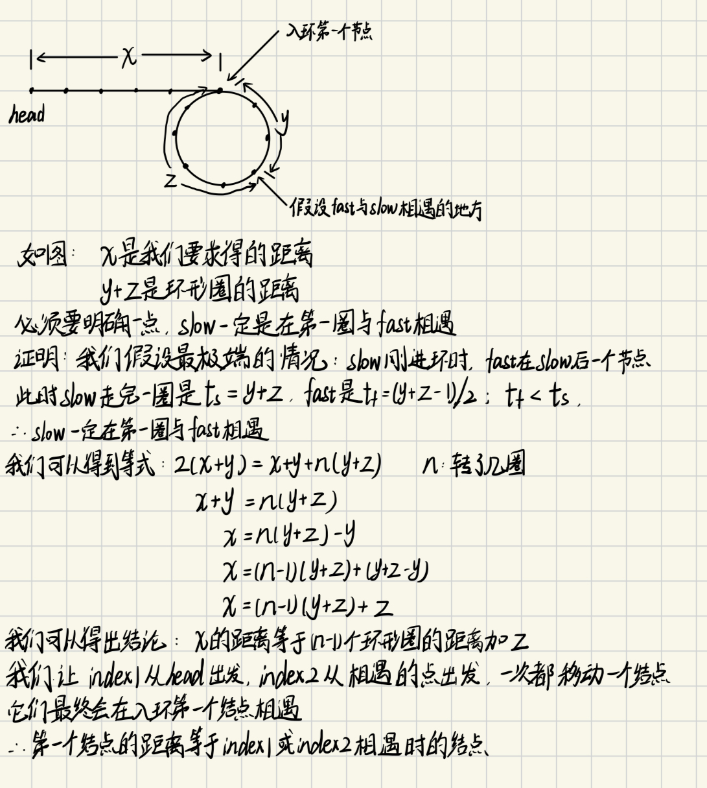

# 第三天

### 基础复习
##### 构建一个链表，我们最开始做的操作就是链表节点的定义，这里给出通用代码
##### 详细信息可以在<a href="https://www.hello-algo.com/chapter_array_and_linkedlist/linked_list/">“Hello 算法”链表章节了解</a>


```c++
// 单链表
struct ListNode {
    int val;  // 节点上存储的元素
    ListNode *next;  // 指向下一个节点的指针
    ListNode(int x) : val(x), next(NULL) {}  // 节点的构造函数
};
```
##### 还需要明确一点，操作任何一个节点都需要知道当前节点的上一个节点，这就跟链表的定义有关了；只有你明确这一点，那后面所有增删改查的操作都是围绕此展开的


## 链表：1.移除链表元素
###  对应力扣 <a href="https://leetcode.cn/problems/remove-linked-list-elements/description/">203.移除链表元素</a>
##### 本题其实就是简单的链表操作，可以分为两个步骤：（1）便利链表，找到要求的val值 （2）改变链表的指向关系，从而删除节点 （3）释放删除的节点
##### 本题存在两种解法（1）单独考虑头结点 （2）虚拟节点
#### 单独考虑头结点
##### 如果头结点的值就是对应的val并且头结点不为空，我们其实就是让头结点等于头结点的下一个节点head=head->next，当然别忘了删除旧头结点的值，这里我们定义了tmp节点用于接收旧头结点，到时候直接删除tmp就可以了；
##### 此时旧头结点已经删去，我们定义cur节点遍历整个链表进行删除操作，这个地方直接看代码没问题,很好理解的


```c++
ListNode* removeElements(ListNode* head, int val) {
    //移除头结点
    while(head!=NULL && head->val==val)
    {
        ListNode* tmp=head;
        head=head->next;
        delete tmp;
    }
    ListNode *cur=head;
    while(cur!=NULL && cur->next!=NULL)
    {
        if(cur->next->val==val)
        {
            ListNode* tmp=cur->next;
            cur->next=cur->next->next;
            delete tmp;
        }
        else
        {
            cur=cur->next;
        }
    }
    return head;
}
```

## (2）虚拟节点

##### 第一种方法我们需要单独考虑头结点的删除情况，虽然并不麻烦，但是代码并不统一，其实说白了虚拟节点就是在头结点前面再创建一个节点
因为前面讲过，添加、删除节点都是需要借助前面一个节点，所以如果我们在头结点前面添加一个节点，就能像普通节点一样操作
##### 这里我们进行虚拟节点的设置，先给虚拟节点dummyHead设置一个值，然后让他下一个位置指向头结点，我们的cur节点就可以从虚拟节点开始便利了

```c++
ListNode* dummyHead=new ListNode(0); //设置一个虚拟头结点
dummyHead->next=head; //把虚拟头结点放在head的前面
ListNode* cur=dummyHead;
```
##### 后面的操作其实就和普通节点的删除一样，通过cur节点遍历，发现cur->next->val==val 就让cur->next=cur->next->next从而跳过cur->next节点，实现删除，别忘了释放节点。那个操作画图很好理解
##### 最后一步应该返回虚拟节点后的头结点，因为此时旧头结点有可能被删除，虚拟节点后的节点一定是头节点


```c++
ListNode* removeElements(ListNode* head, int val) {
   ListNode* dummyHead=new ListNode(0); //设置一个虚拟头结点
   dummyHead->next=head; //把虚拟头结点放在head的前面ListNode* cur=dummyHead;
   while(cur->next!=NULL)
   {
       if(cur->next->val==val)
       {
           ListNode* tmp=cur->next;
           cur->next=cur->next->next;
           delete tmp;
       }
       else
       {
           cur=cur->next;
       }
   }
   //返回新链表的头结点
    return dummyHead->next;
}
```

## 链表：2.设计链表
#### 对应力扣 <a href="https://leetcode.cn/problems/design-linked-list/solutions/281357/707-she-ji-lian-biao-cyu-yan-chao-xiang-xi-ban-ben/">707.设计链表</a>
##### 这个案例非常重要，它包括了链表的增删改查，非常有意义，请务必吃透这道题
##### 首先是链表的定义，这里再放一次加深影响

```c++
public:
    struct NodeList{
        int val;
        NodeList* next;
        NodeList(int x):val(x),next(NULL){}
    };
```
##### 因为在整个程序中我们都会使用两个变量，一个是虚拟头结点_dummyHead，另一个是链表的长度_size，所以所以别忘了定义和初始化

```c++
private:
    int _size;
    NodeList* _dummyHead;
```

```c++
//初始化
    MyLinkedList() {
        _dummyHead = new NodeList(0); // 这里定义的头结点 是一个虚拟头结点，而不是真正的链表头结点
       _size = 0;
    }
```
##### 请注意，第0个节点是物理意义上的第一个节点；如果index的值小于0或者他大于了链表的长度，直接返回-1
##### while循环就是到达index个节点，到达后退出while循环，返回cur的值就可以了，这里还要强调cur是从虚拟节点出发，
##### 你可以理解是从-1号位置出发，所以不需要index-1


```c++
    //获取第n个链表的值
    int get(int index) {
        if(index<0||index> _size-1)
            return -1;
        NodeList* cur=_dummyHead->next;
        while(index)
        {
            cur=cur->next;
            index--;
        }
        return cur->val;
    }
```

##### 我们通过newNode节点接收值，这个地方注意顺序，先让newNode连接_dummyHead->next，再让_dummyHead->newNode，如果顺序错误会导致节点无法连接


```c++
    //头部插入节点
    void addAtHead(int val) {
        NodeList* newNode=new NodeList(val);
        //注意顺序问题
       newNode->next=_dummyHead->next;
       _dummyHead->next=newNode;
       _size++;
    }
```

##### 没什么好说的，cur通过while循环遍历链表，直到cur->next==NULL 就代表cur已经到了链表末尾，此时令cur->next=newNode 就可以了

```c++
    //在尾部插入节点
    void addAtTail(int val) {
        NodeList* cur=_dummyHead;
        NodeList* newNode=new NodeList(val);
        while(cur->next!=NULL)
        {
            cur=cur->next;
        }
        cur->next=newNode;
        _size++;
    }
```

##### 这里相比头结点和尾结点添加唯一的区别就是要判断index值的有效性，其他没什么说的，看代码就行了

```c++
    //在第index个节点之前添加元素
    void addAtIndex(int index, int val) {
        if(index > _size) return;
        if(index < 0) index = 0;
        NodeList* cur=_dummyHead;
        NodeList* newNode=new NodeList(val);
        while(index--)
        {
            cur=cur->next;
        }
        newNode->next=cur->next;
        cur->next=newNode;
        _size++;
    }
```

##### 跟移除元素那道题很像，看代码就行了，别忘了释放内存

```c++
    //在index节点之前删除节点
    void deleteAtIndex(int index) {
        if (index >= _size || index < 0) {
            return;
        }
        NodeList* cur=_dummyHead;
        while(index--)
        {
            cur=cur->next;
        }
        NodeList* tmp=cur->next;
        cur->next=cur->next->next;
        delete tmp;
        _size--;
    }
```

## 中午刷题刷到了一道关于链表的题觉得很有意思就记录下来
#### 对应力扣 <a href="https://leetcode.cn/problems/add-two-numbers/">2.两数相加</a>
##### 这道题表面上看是一道链表题，但其实他最本质的地方不在于此，只是单纯的遍历操作;真正的
有意思的地方在于手动实现十进制的加减，因为每个链表中的节点数在范围 [1, 100] 内，我们靠long long
是无法进行这个量级的数字相加减，所以只能用字符串的形式实现加减。

##### 我们先来解决字符串加减问题，关键是十进制进位问题

```c++
string add(string str1, string str2) {
    int size1 = str1.size() - 1;
    int size2 = str2.size() - 1;
    int digit = 0;
    string result;
    while (size1 >= 0 || size2 >= 0 || digit > 0) { 
        int num1 = size1 >= 0 ? (str1[size1] - '0') : 0;
        int num2 = size2 >= 0 ? (str2[size2] - '0') : 0;
        int sum = num1 + num2 + digit; 
        digit = sum / 10; // 计算进位
        sum = sum % 10; // 取个位数
        result += to_string(sum);
        size1--;
        size2--;
    }
    reverse(result.begin(), result.end());
    return result; // 将结果返回，而不是直接打印
}
```

##### 理解这个后其实这道题就没有什么难度了，我能想到的做法是吧链表的所有值用string表示出来然后进行相加，最后再把新的字符串放进新的链表中

```c++
/**
 * Definition for singly-linked list.
 * struct ListNode {
 *     int val;
 *     ListNode *next;
 *     ListNode() : val(0), next(nullptr) {}
 *     ListNode(int x) : val(x), next(nullptr) {}
 *     ListNode(int x, ListNode *next) : val(x), next(next) {}
 * };
 */
class Solution {
public:
    ListNode* addTwoNumbers(ListNode* l1, ListNode* l2);
    string input(ListNode* l);
    string add(string str1,string str2);
};
string Solution::add(string str1,string str2)
{
    int size1 = str1.size() - 1;
    int size2 = str2.size() - 1;
    int digit = 0;
    string result;
    while (size1 >= 0 || size2 >= 0 || digit > 0) { // 这里应该考虑进位 digit
        int num1 = size1 >= 0 ? (str1[size1] - '0') : 0;
        int num2 = size2 >= 0 ? (str2[size2] - '0') : 0;
        int sum = num1 + num2 + digit; // 这里需要加上 digit
        digit = sum / 10; // 计算进位
        sum = sum % 10; // 取个位数
        result += to_string(sum);
        size1--;
        size2--;
    }
    //这个地方不需要反转了
    return result; 
}
string Solution::input(ListNode* l)
{
    //创建虚拟头节点
    ListNode* dummyHead=new ListNode(0);
    dummyHead->next=l;
    ListNode* cur=dummyHead;
    string res;
    while(cur->next!=nullptr)
    {
        res+=to_string(cur->next->val);
        cur=cur->next;
    }
    reverse(res.begin(),res.end());
    return res;
}
ListNode* Solution::addTwoNumbers(ListNode* l1, ListNode* l2) 
{
    string result=add(input(l1),input(l2));
    
    ListNode* dummyHead=new ListNode(0);
    ListNode* cur=dummyHead;
    for(char c:result)
    {
        cur->next=new ListNode(c-'0');
        cur=cur->next;
    } 
    return dummyHead->next;
}
```

# 第四天
## 链表：3.反转链表
#### 对应力扣 <a href="https://leetcode.cn/problems/reverse-linked-list/submissions/527372991/">206.反转链表</a>
##### 本题目的很明确，无非是改变链表的指向。这里给出双指针和递归方法

### 双指针

##### 我们定义两个指针pre和cur用于定位两个需要交换的节点。关于初始化cur毫无疑问就是当前的头结点，但头结点前面是没有节点的，所以我们使pre指向nullptr

```c++
ListNode* cur=head;
ListNode* pre=NULL;
```

##### 我们进行的操作是让cur->next=pre,然后双指针前进，这里有一个问题是我们让cur->next=pre后，无法找到原来cur->next节点，所以我们需要创建一个tmp指针去接收旧的cur->next，关于cur和pre的代码顺序也有讲究，我们应该让pre先等于cur，再让cur=tmp，如果顺序反了，会让pre直接到tmp的位置

```c++
//双指针
ListNode* reverseList(ListNode* head) {
    ListNode* cur=head;
    ListNode* pre=NULL;
    while(cur)
    {
        ListNode* tmp=cur->next;
        cur->next=pre;
        pre=cur;
        cur=tmp;
    }
    return pre;
}
```

### 递归方法

##### 递归方法本质还是用双指针方法，但是更难理解，代码也更简洁

##### 截止条件是当cur为nullptr时，返回pre（头指针），reverse()函数传入cur和pre

```c++
//递归解法
//这个地方定义递归函数reverse
ListNode* reverse(ListNode* cur,ListNode* pre){
    if(cur== nullptr) return pre;
    ListNode* tmp=cur->next;
    cur->next=pre;
    return reverse(tmp,cur);
}

ListNode* reverseList(ListNode* head) {
    return reverse(head, nullptr);
}
```

## 链表：4.两两交换链表中的节点

#### 对应力扣 <a href="https://leetcode.cn/problems/swap-nodes-in-pairs/">24.两两交换链表中的节点</a>

##### 本题是两两交换节点，比如1->2->3->4 交换后应变成2->1->4->3, 对于奇数个结点1->2->3 应该是2->1->3；

##### 首先定义一个虚拟头结点dummyHead，让他指向head头结点，此时1->2变成了dummyHead->1->2,只有知道要交换两个节点的前一个节点才能进行交换操作

```c++
对于dummyHead->1->2->3
先让cur=dummyHead
cur->2
再让2->1
1->3
最后cur=cur->next->next再进行如上操作
```
##### 至于while循环的介质条件，当节点有偶数个cur->next为nullptr退出循环，当节点为奇数个时cur->next->next==nullptr退出循环，这个顺序不能改变，如果交换假如cur->next==nullptr,那cur->next->next就会为nullptr->next这是不合法的

```c++
ListNode* swapPairs(ListNode* head) {
    ListNode* dummyHead=new ListNode(0);
    dummyHead->next=head;
    ListNode* cur=dummyHead;
    while(cur->next != nullptr && cur->next->next != nullptr)
    {
        ListNode* tmp=cur->next;
        ListNode* tmp1=cur->next->next->next;
        cur->next=cur->next->next;
        cur->next->next=tmp;
        tmp->next=tmp1;
        cur=cur->next->next;
    }
    return dummyHead->next;
}+
```
# 第五天
## 链表：5.删除链表倒数第n个节点

### 对应力扣<a href="https://leetcode.cn/problems/remove-nth-node-from-end-of-list/submissions/527638225/">19.删除链表倒数第n个节点</a>

##### 这道题的删除操作其实我们前面讲解过，要删除一个节点，我们必须通过他前面的一个节点实现删除，到这里，要删除倒数第n个节点，就需要通过n+1个节点删除，我们可以定义一个快指针，一个慢指针；快指针先走n+1步，这时慢指针再移动；如果快指针等于nullptr了，那此时慢指针也到达了倒数第n+1个节点，这时就可以删除了。

##### 思想并不复杂，代码也好理解

```c++
ListNode* removeNthFromEnd(ListNode* head, int n) {
    ListNode* dummyHead=new ListNode(0);
    dummyHead->next=head;
    ListNode* fast=dummyHead;
    ListNode* slow=dummyHead;

    //快指针走n+1步
    n++;
    while(n-- && fast!= nullptr){
        fast=fast->next;
    }
    while (fast)
    {
        fast=fast->next;
        slow=slow->next;
    }
    ListNode* tmp=slow->next;
    slow->next=slow->next->next;
    //释放内存
    delete tmp;

    return dummyHead->next;
}
```

## 链表：6.环形链表II

### 对应力扣 <a href="https://leetcode.cn/problems/linked-list-cycle-ii/description/">142.环形链表</a>

##### 这道题在理解上颇具难度，其实可以分为两问（1）判断链表是否是环形链表 （2）寻找环形节点

### (1) 判断链表是否为为环形链表

##### 我们分别定义一个快指针fast，和慢指针slow；快指针肯定最先进入环形区域，这个时候快指针可能已经绕了很多圈了，慢指针才进入环形圈，我们如何给fast和slow指针设定速度才能保证他们一定能相遇呢？

##### 其实我们让fast一次走两个节点，slow一次走1个节点，就能保证他们一定能相遇

##### 怎么证明？当slow进入环形圈时，fast可能在环形圈任意位置，此时fast比slow的速度快一个节点，他们就像在操场跑操一样是一个追逐的过程，fast以1个节点的速度逼近slow，他们一定会相遇

##### 此时我们就证明如果有环形节点fast和slow一定会相遇

```c++
 ListNode* fast=head;
 ListNode* slow=head;
        while(fast != nullptr && fast->next != nullptr){
            slow = slow->next;
            fast = fast->next->next;
        }
        return nullptr;
    }
```

### (2) 寻找环形节点



```c++
    ListNode *detectCycle(ListNode *head) {
        ListNode* fast=head;
        ListNode* slow=head;
        while(fast != nullptr && fast->next != nullptr){
            slow = slow->next;
            fast = fast->next->next;
            //fast和slow相遇
            if(fast==slow){
                ListNode* index1=fast;
                ListNode* index2=head;
                //他们不相遇时都向前移动一个节点
                while(index1 != index2){
                    index1=index1->next;
                    index2=index2->next;
                }
                return index1;
            }
        }
        //如果fast和slow不相遇则不是环形链表
        return nullptr;
    }
```

